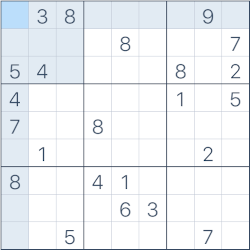
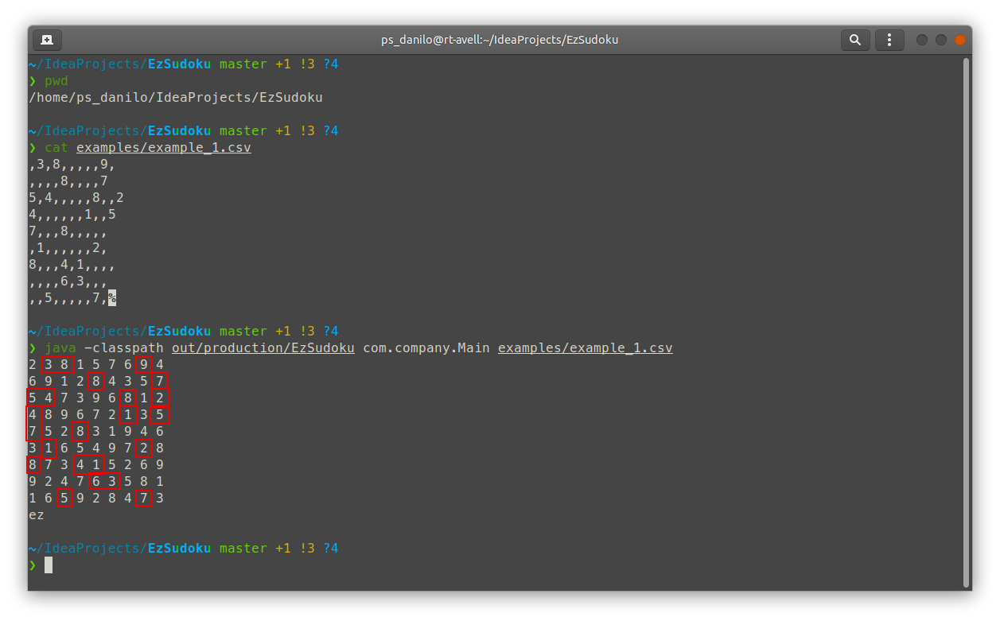
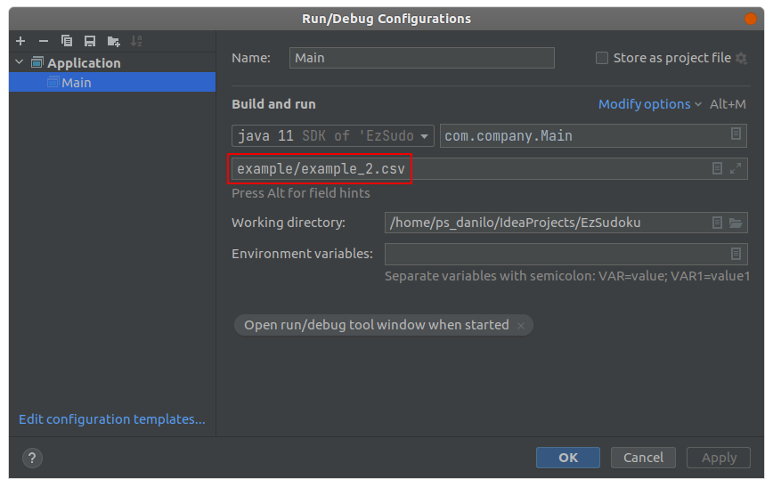

# EzSudoku

This program reads a CSV file as a 9x9 Sudoku matrix and tries to solve it. Inside [**examples**](./examples) folder there is 2 Sudoku examples. The example below came from [**sudoku.com**](https://sudoku.com/expert/) and it was converted to [**a CSV file**](./examples/example_1.csv).



**EzSudoku** outputs this solution for the Sudoku above:



## Running

In order to run this project you have 2 options: [**CLI**](#cli) or by [**creating a run configuration on IntelliJ IDEA**](#creating-a-run-configuration-on-intellij-idea).

### CLI

First you need to build the project by hitting **CTRL + F9** (or through the menu: **Build/Build Project**). Then you will be able to run it via CLI:

```
java -classpath out/production/EzSudoku com.company.Main examples/example_1.csv
```

### Creating a run configuration on IntelliJ IDEA

Create a run configuration and add a CSV Sudoku file as parameter.

